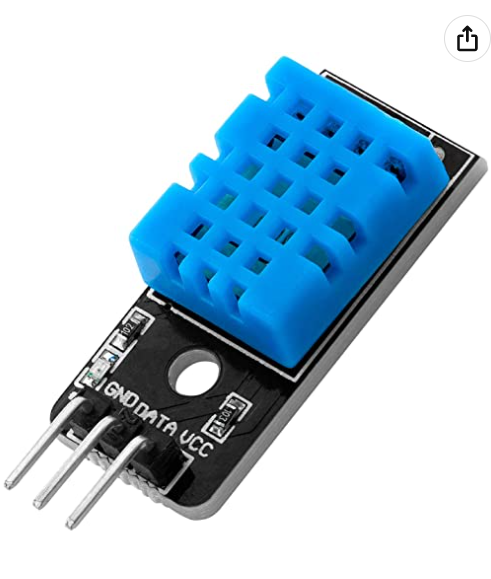
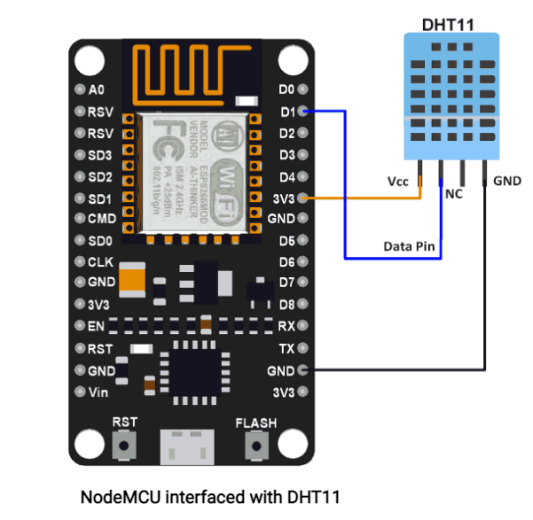
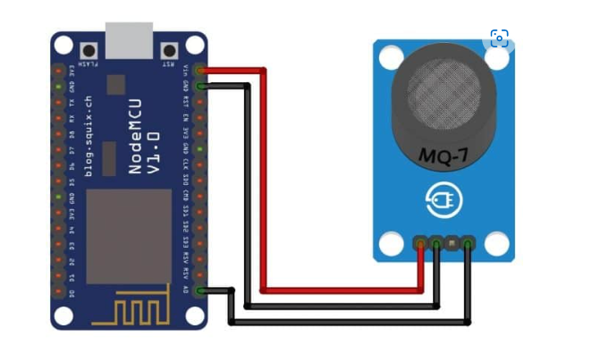
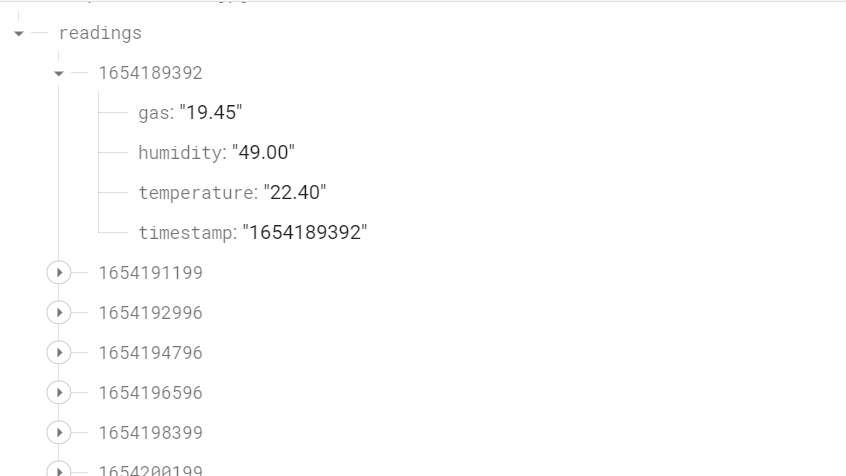
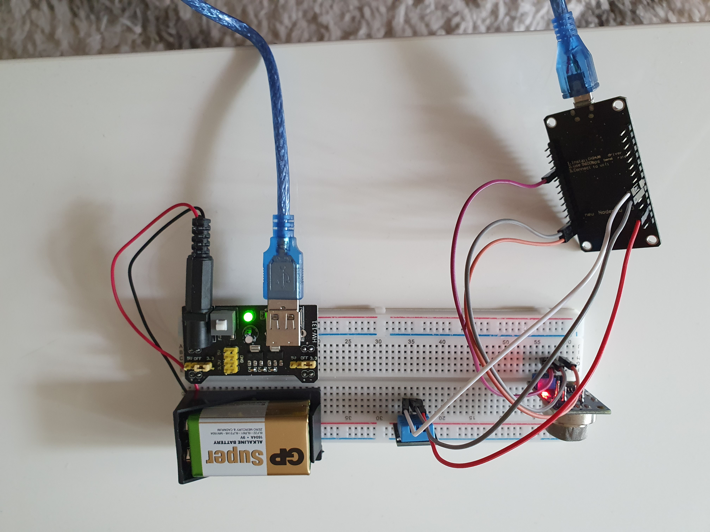
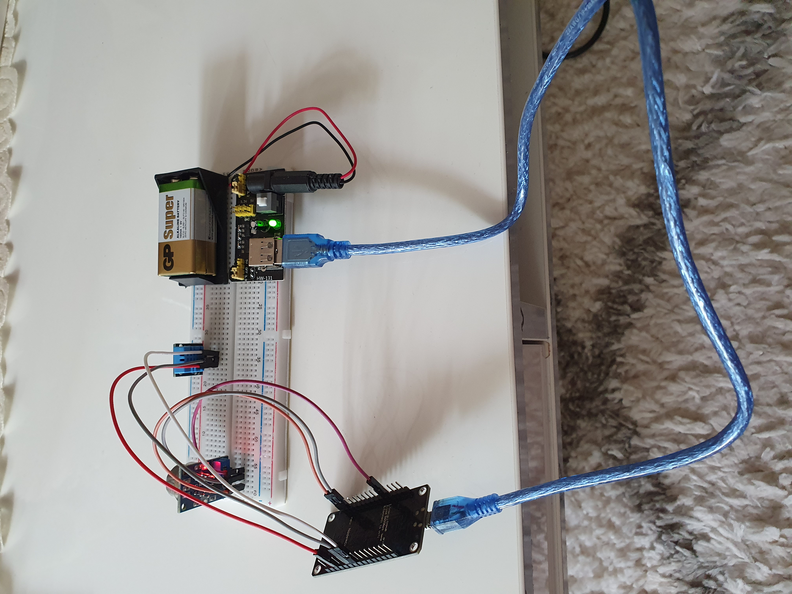

# Tutorial
## Tutorial on how to build a temperature/humidity and gas sensor with DHT11, MQ35 and NodeMCU Esp8266

### Brief Description
- Title: Room-Air-Quality
- Short overview: It is an IoT project which uses DH11 and MQ135 sensor to evaluate the air quality and send the data
via Node MCU ESP8266 with Wi-Fi connection to FireBase real-time database. The data in Firebase is accessible via a REST API
and is shown in a bar chart in Vue client apps.
- Working Time: totalt approximately 50 hours (IoT thing, API, Client and deployment)

### Objective
I have an air purifier in my room and I want to check if the air quality becomes better if I have run it for a while. As a result,
I looked for sensor that can examine humidity/temperature and CO2, smoke level in the room then I found DHT11 and MQ135 sensor.
The data needs to send somewhere so I did choose Node MCU ESP8266 to connect with FireBase cloud via my wi-fi connection. This IoT will
help you to evaluate air quality wherever you are with an available wi-fi connection. The data is sent every 30 minutes to real-time database Firebase. This thing can be adapted in the room or in the office to check the air quality. 

### Material

List of material: 
+ 1 NodeMCU ESP8266 12F: send Data via Wi-fi (microcontroller)
+ bredboard: link between the sensor and the wire
+ Jumper Wires : connect NodeMCU to sensor (DHT11 and MQ135)
+ 1 battery 9V : energy for IoT thing
+ battery connector: link battery to IoT thing
+ 1DHT11: sensor for humidity and temperature
+ 1MQ135: sensor for gas level
+ USB cable 2.0: connect the NodeMCU ESp8266 to the Arduino IDE for loading the code

| IoT thing         | Price | Where to buy                              |  
|-------------------|-------|-------------------------------------------|
| Node MCU ESP8266  | 90kr  | [Amazon](https://www.amazon.se/)          |  
| Sensor Package    | 300kr | [Elektrokit](https://www.electrokit.com/) |  
| MQ35              | 78kr  | [Amazon](https://www.amazon.se/)          |  
| Battery 9V        | 25kr  | [Amazon](https://www.amazon.se/)          |   
| Battery Connector | 25kr  | [Amazon](https://www.amazon.se/)          |   
| Bredboard package | 150kr | [Amazon](https://www.amazon.se/)          |   
| Totalt            | 668kr |                                           |   
|                   |       |                                           |  





### Computer setup

- IoT thing is programmed with C++ in Arduino IDE for Window and different libraries (DHT library, Adafruit library, Firebase library...). The Adafruit library is included in the folder thing. Other can be found in Arduino library.
- The code is uploaded via PORT(COM3) in Arduino with help of the USB cable 2.0 via a computer. The tool must be identified to NodeMCU ESP 8266 12F.
- To set up IoT, Arduino IDE must be installed and has access to the library. The wi-fi credentials needs to be provided by the user to connect to FireBase real-time database. 


### Putting everything together

- Circuit diagram 





- *Electrical calculations: NodeMCU ESP8266 always uses between 3.3V to 5V. DHT11 has 3 legs and MQ135 has 4 legs. MQ135 evaluates the gas level via analog A0 in NodeMCU ESP8266. This project can be used in both development and production. 

### Platform

- Firebase real-time database service is used as cloud pattern for this IoT project. It is
a free plan for 1GB storage and 10GB downloads per month. If the project has more data to store, it is still a good choice with Firebase for Blazer plan for $0.108 per additional GB. Pusher free plan is used as webhook to send data from API to client with 200 000 message a day.  
- The reason why I choose Firebase because it has supported Arduino project for a long time and the data is up to date fast with real-time data and it is easy to delete or adding data to database directly. The instructions how to work with Firebase for different programming languages are easy and detailed to follow. 

### The code

```C++=
if (Firebase.ready() && (millis() - sendDataPrevMillis > timerDelay || sendDataPrevMillis == 0)){
    sendDataPrevMillis = millis();

    //Get current timestamp
    timestamp = getTime();
    Serial.print ("time: ");
    Serial.println (timestamp);

    parentPath= databasePath + "/" + String(timestamp);

    json.set(tempPath.c_str(), String(dht.readTemperature()));
    json.set(humPath.c_str(), String(dht.readHumidity()));
    json.set(presPath.c_str(), String(h/1023*100));
    json.set(timePath, String(timestamp));
    Serial.printf("Set json... %s\n", Firebase.RTDB.setJSON(&fbdo, parentPath.c_str(), &json) ? "ok" : fbdo.errorReason().c_str());

# This function will read the data for humidity/temperature from DHT11 with help of DHT library and send to FireBase via wi-fi. The
gas level is collected from A0 analog and calculated then sent to Firebase too.
```

### Data flow / Connectivity

IoT thing ---> FireBase real-time database ---> API ---> Pusher webhook ---> Vue graph app

- The data is sent every 30 minutes to FireBase and the API will get the last 12 data to show up 
for the client.
- Wifi protocols has been used
- Pusher is used as webhook to transfer data from API to client.
- It depends on how far the IoT from Wi-fi router for battery consumption. The data is sent every 30 minutes to save the storage on cloud and minimize battery consumptions. 

### Presenting the data

- Provide visual examples of how the dashboard looks. Pictures needed.
- How often is data saved in the database: The data is sent and saved direct to Firebase database every 30 minutes.
- *Explain your choice of database: Firebase real-time database has good supports for Arduino project with different libraries. The data is sent and stored fast. It is easy to manage the data like adding more data or delete one of them. Since it is free plan so it only gives 1GB for storage but it is already bigger than Mongo Atlas with only 512MB. The reason for my choice is that it is real-time database. The picture below shows how the data in Firebase database looks like.



- *Automation/triggers of the data: The data is sent via webhook - Pusher from FireBase to client via API. Pusher will trigger an event in API then bind it to a channel to receive data from FireBase.
- Because of the limitation of the storage of Firebase (1GB/month), the old data might be deleted each month to get more space.

### Finalizing the design

Show the final results of your project. Give your final thoughts on how you think the project went. What could have been done in another way, or even better? Some pictures are nice!

- Show the final results of the project
I have added WoT Thing Description for a Simple Default TD IoT project to API. The project has 3 parts: IoT thing (NodeMCU ESP8266, DHT11 and MQ135), REST API for communication between client and FireBase database and the Vue3 client apps which uses D3 to show a real-time bar chart for humidity. Data is sent to client every 15 seconds via Pusher. 

- Pictures: The final project is shown below. The data begins sending to Firebase when the ON/OFF button is ON. At that time, energy from battery will help NodeMCU to send the data it get from 2 sensor.





- Video of project
[Youtube](https://www.youtube.com/watch?v=ZkG5hSEqiz0)


